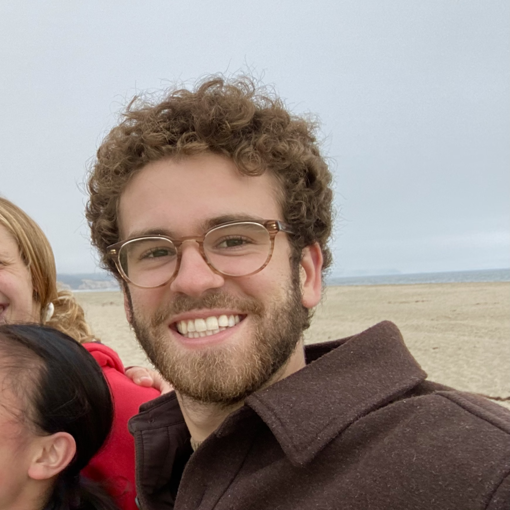

 
  

I'm a technical writer at Salesforce, where I document Salesforce’s Commerce Cloud with a focus on AI features and API resources for developers. 

Previously, I was a computational research assistant at the [Wesleyan Media Project](https://mediaproject.wesleyan.edu/) while receiving my B.A. in Psychology and Data Science at Wesleyan University. In my work for the Media Project, I applied data science and statistical analysis methodologies to answer questions about political advertising on digital platforms like Facebook and Snapchat.

I'm currently based in San Francisco and love to fill my free time with running, skateboarding, and playing guitar. 

Please see my resume for more information on my background, and feel free to reach out via [LinkedIn](https://www.linkedin.com/in/spencer-russell-dean/) or [email](mailto:sdean136@gmail.com).
