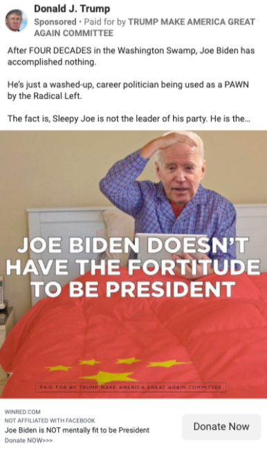
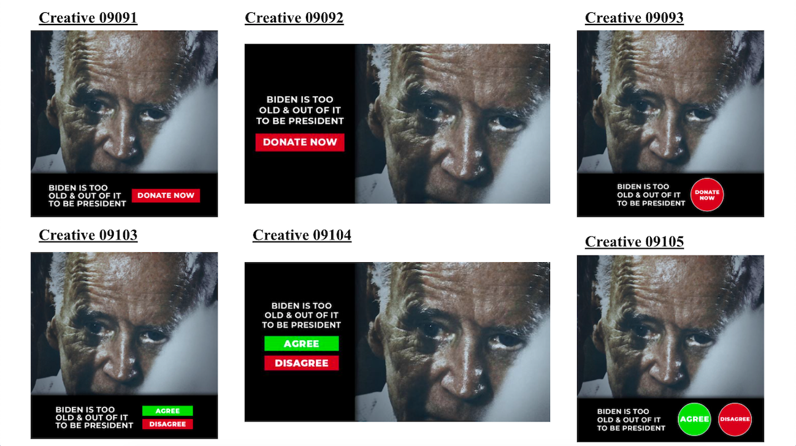
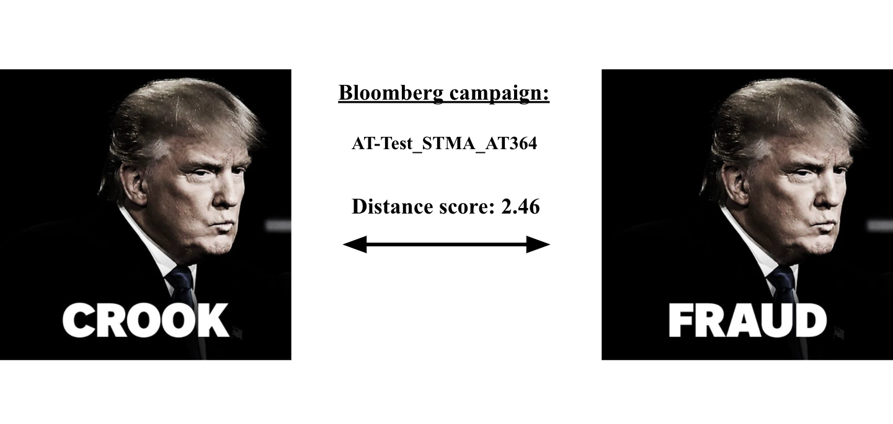

## Abstract

  A/B tests are a common feature of modern digital advertising. They can be defined as field experiments involving two or more variants of a message or advertisement designed to determine which performs best. Previous research has found evidence of extensive use of A/B testing by Donald Trump in the 2016 U.S. presidential election on Facebook. However, the extent of this experimental approach to campaigning has not been thoroughly researched. This project provides an initial exploration of A/B testing by 2020 presidential candidates on Facebook by first defining a framework for detecting A/B tests of visually similar ads, and then applying this framework to compare the Facebook strategies of candidates Trump and Mike Bloomberg. This project also sought to detect evidence of A/B test “decisions” — the points at which individual ads within experiments would be identified as the best performers and would receive additional funding — by employing a technique for outlier detection based on the change in ad spend. The results suggest that Trump’s campaign employed such A/B tests at a higher rate and volume, but the general approach was shared by Bloomberg’s campaign. Furthermore, while Trump’s A/B tests tended to experiment with more distinct visuals, Bloomberg’s utilized a greater number of textual variations. Lastly, detecting A/B test winners was rare, especially for Bloomberg, and this finding may suggest that both campaigns used more complex A/B test paradigms than simply selecting single winning ads. Overall, these results provide a valuable step toward fully understanding the world of experimental digital advertising by politicians.

## Introduction and Literature Review

When Donald Trump—a political outsider with inauspicious polling numbers—defeated Hillary Clinton in the 2016 U.S. presidential election, many pundits sought answers to explain his largely unforecast success. Several compelling narratives emerged, one of which pointed toward the Republican candidate's advantage in digital advertising, particularly on Facebook. News coverage added a sinister mystique to Trump's 2016 digital advertising strategy by focusing on provocative stories of foreign interference by Russia, unethical data collection and psychographic manipulation by political consulting firm Cambridge Analytica, and the "microtargeting" of audiences in narrowly defined demographics.^[Madrigal, Alexis C. “Russia's Troll Operation Was Not That Sophisticated.” The Atlantic, Atlantic Media Company, 19 Feb. 2018, www.theatlantic.com/technology/archive/2018/02/the-russian-conspiracy-to-commit-audience-development/553685/.] ^[Karpf, Dave. “Will the Real Psychometric Targeters Please Stand Up?” Civic Hall, Civic Hall, 1 Feb. 2017, civichall.org/civicist/will-the-real-psychometric-targeters-please-stand-up/.] ^[ Borgesius et al., Online Political Microtargeting: Promises and Threats for Democracy (February 9, 2018). Utrecht Law Review, Vol. 14, No. 1, p. 82-96, 2018, Available at SSRN: https://ssrn.com/abstract=3128787] However, critical evaluation of the evidence instead suggests that Trump's digital advantage can be attributed mostly to a steadfast devotion to Facebook, and a willingness to budget large sums of money for ads on their platform.^[Bogost, Ian, and Alexis C. Madrigal. “How Facebook Works for Trump.” The Atlantic, Atlantic Media Company, 18 Apr. 2020, www.theatlantic.com/technology/archive/2020/04/how-facebooks-ad-technology-helps-trump-win/606403/.]

A discordance between the narrative and reality of Trump's digital advertising efforts is furthered by controversial, larger-than-life figures in his circle. For example, his 2016 digital director and campaign director for most of 2020, Brad Parscale, is, depending on who you ask, either a social media mastermind or just an average marketer with a massive budget to blow.^[Marantz, Andrew. “The Man Behind Trump's Facebook Juggernaut.” The New Yorker, Condé Nast, 2 Mar. 2020, www.newyorker.com/magazine/2020/03/09/the-man-behind-trumps-facebook-juggernaut.] Parscale himself has boasted about running the "most efficient [campaign] in history" by developing an automated web-based ecosystem for advertising.^[Bowles, Nellie, and Annie Karni. “Brad Parscale Fell From Trump's Favor. Now He's Plotting a Comeback.” The New York Times, The New York Times, 24 Dec. 2020, www.nytimes.com/2020/12/24/us/politics/brad-parscale-trump-campaign.html?action=click.] This system, initiated in 2016 and built upon through 2020, embodied the two central tenets of modern data-driven campaigning: *targeting* and *testing*.

Firstly, with Facebook as Parscale's platform of choice, opportunities arose to *target* ads at specific audiences in order to optimize distinct goals. Facebook collects massive troves of data on its users, like location, gender, age, education-level, and more complex lifestyle characteristics which can be derived from their online activity. The platform also provides advertisers with a feature called "lookalike audiences," which takes an existing set of users (e.g., a spreadsheet of Trump supporters who have signed onto his email list) and leverages Facebook data to algorithmically identify similar users. This opened the door for targeting known or likely Trump supporters with fundraising messages, so that minimal budget was wasted putting the ads in front of users with a low probability of donating. It also meant the campaign could target negative attack ads at swing voters or lean-Clinton voters with the objective of lowering her election day turnout.

The categories into which audiences were grouped and targeted were likely more broad—like supporters vs. non-supporters—than many have imagined. For example, some have suggested the campaigns could, theoretically, segment ads for "paintball-playing widowers in the Florida panhandle."^[Marantz, Andrew. “The Man Behind Trump's Facebook Juggernaut.” The New Yorker, Condé Nast, 2 Mar. 2020, www.newyorker.com/magazine/2020/03/09/the-man-behind-trumps-facebook-juggernaut.] Although Facebook reports limited data on ad targeting—just gender, age, and location, other social media app Snapchat divulges more information on how political ads target users based on their interests. An analysis of Snapchat data from the 2020 presidential election reveals that instances of microtargeting based on interests (e.g. "Outdoor & Nature Enthusiasts", "TV Network Viewers (CNN)", etc.) were isolated and small-scale. Over 90 percent of ads did not target users based on interests and instead aimed to reach broad swaths of the electorate, usually within a given list of states.^[Dean, Spencer. “Presidential Advertising By Candidates Reveals Microtargeting Tactics on Snapchat.” DELTA Lab, Wesleyan Media Project, 28 Oct. 2020, deltalab.research.wesleyan.edu/2020/10/28/presidential-advertising-on-snapchat/.] Still, researchers believe Facebook's targeting techniques, including lookalike audiences, had an instrumental role in the 2016 Trump campaign, and that they may have been particularly crucial in fundraising efforts.^[Baldwin-Philippi, Jessica. “The Myths of Data-Driven Campaigning.” Political Communication, vol. 34, no. 4, 2017, pp. 627–633., doi:10.1080/10584609.2017.1372999.]

The second key aspect of data-driven campaigning embraced by Parscale was message testing. This strategy involves A/B testing, in which campaigns experiment with slightly altered versions of ads before deciding upon one to move forward with and put more money into. Digital A/B testing was first introduced to political advertising by the Obama campaign in 2008.^[Issenberg, Sasha. The Victory Lab: the Secret Science of Winning Campaigns. B/D/W/Y, Broadway Books, 2016.] In one example, they tested three distinct messages for the sign up prompt on their website: *learn more*, *join us now*, and *sign up now*. They found that the phrase *learn more* outperformed the others by nearly 20 percent, so this was the final message they decided upon.^[Bashyakarla, Varoon. “A/B Testing: Experiments in Campaign Messaging.” A/B Testing: Experiments in Campaign Messaging - Our Data Our Selves, Tactical Tech, 2019, ourdataourselves.tacticaltech.org/posts/ab-testing/.]

In 2016, Parscale and the Trump campaign took the strategy of A/B testing to an extreme on Facebook. By some reports, they were testing as many as 50,000 Facebook ad variants per day.^[Lapowsky, Issie. “This Is How Facebook Actually Won Trump the Presidency.” Wired, Condé Nast, 3 June 2017, www.wired.com/2016/11/facebook-won-trump-election-not-just-fake-news/.] Although in 2016 Trump had a budget thirty percent smaller than Clinton—who raised over a billion dollars, much of which went towards TV ads—his campaign carried an advantage on Facebook of \$44 million to $28 million. This discrepancy is even more pronounced when examining the number of ad variations run on the platform: in total, the Trump campaign ran 5.9 million Facebook ads while the Clinton campaign ran 66,000.^[Denning, Steve. “How Agile Helped Elect Donald Trump.” Forbes, Forbes Magazine, 23 July 2018, www.forbes.com/sites/stevedenning/2018/07/22/how-agile-helped-elect-donald-trump/.]

Data-driven campaigning has a tendency to be misrepresented and mythologized. According to Jessica Baldwin-Phillipi, author of *Using Technology, Building Democracy: Digital Campaigning and the Construction of Citizenship*, "the known impact of data-driven social media tactics is not equivalent to the headlines." Journalists have often overblown the degree to which analytics are objective, the effectiveness of more data meaning more and better knowledge, and stories of data "nerds" transforming political campaigns as objective outsiders.^[Baldwin-Philippi, Jessica. “Data Ops, Objectivity, and Outsiders: Journalistic Coverage of Data Campaigning.” Political Communication, vol. 37, no. 4, 2020, pp. 468–487., doi:10.1080/10584609.2020.1723751.] Broad descriptive statistics, figures like 5.9 million ads and $44 million, are common, but we lack detailed understandings of how these strategies are enacted. Additionally, while prior press coverage and academic research has focused predominantly on the 2016 Trump campaign, little is known about how other politicians might be employing these same data-driven techniques. 

In order to provide a comparison to Trump’s strategy, this research additionally focuses on the Facebook advertisements of Mike Bloomberg, who campaigned for the 2020 Democratic presidential nomination. Bloomberg was chosen as a reference candidate due to his high level of activity on Facebook. From January through February of 2019, Bloomberg spent over $50 million on Facebook, dwarfing the budgets of all other primary candidates as well as Trump, who spent $27 million over the same period.^[“Presidential Ad Spending Approaches $900 Million.” *Wesleyan Media Project*, Wesleyan Media Project, 26 Feb. 2020, mediaproject.wesleyan.edu/releases-022620/.]

This research aims to produce a review of one particular data-driven advertising strategy—A/B testing on Facebook—by the 2020 Trump and Bloomberg campaigns, in order to provide a better understanding of how these techniques were employed and whether Trump’s campaign was truly exceptional. The 2020 election is especially fruitful for analysis, since Facebook introduced an archive for political ads in 2018 which can be researched to uncover how the platform was used.

As previously discussed, both testing and targeting are features of data-driven campaigning. This paper focuses on the former because relatively more existing research has already addressed targeting.^[“How Political Advertisers Target You on Facebook.” ProPublica, ProPublica, 16 Apr. 2020, projects.propublica.org/facebook-ads/.] The status of A/B testing, however, remains to be fully depicted.

To achieve such a comparison of campaign strategy, this project employed a new machine-learning-based framework for detecting visually similar ad sets. Distinct A/B tests were further defined by grouping ads according to the date on which they aired and the campaign name associated with the ad based on data from its URL. Furthermore, an outlier-detection technique involving Dixon’s Q Test was applied to measures of ad spend in order to detect instances of decision-making within visually-grouped A/B test sets.

## Data

The foundational data for this project comes from Facebook’s Ad Library API, which provides an archive of political ads with detailed information on variables such as the amount spent in U.S. dollars, timeframe run, number of impressions (i.e. views), and demographic data like the geographic region targeted. Ads were associated with their candidate-affiliate (Trump or Bloomberg) through Facebook page matching done by the Wesleyan Media Project.

The spend variable from the Facebook Ad Library API is reported as a bracketed value, e.g. *0-99*. For the purposes of this analysis, a rough approximation of ad-level spend was calculated by taking the mean of these upper- and lower-bound values. For example, an ad in the 0-99 spend bracket would have an estimated spend of 49.5 USD.

The data on ad timeframe from the Facebook Ad Library API is reported by the variable *ad_delivery_start_time*, which provides a timestamp denoting when the ad began to run on Facebook. 

Another crucial component of this project was the data from URLs associated with Facebook advertisements. This data was collected and parsed by Pavel Oleinikov of the Wesleyan Media Project.

The URL data was collected due to its use of UTM (Urchin Tracking Module) codes, a feature of digital advertising campaigns run through Google Analytics. These codes, which are stored within the URLs that load when a user clicks on an ad, allow the advertiser to monitor the performance of their campaigns. One common example of this is the *utm_source* code, which keeps track of where a user clicked on the ad from. For example, an advertiser might want to track how much traffic is coming to their site from ads on Facebook (*utm_source*=facebook) vs. news sites, which could each have their own *utm_source* codes.

Bloomberg campaign ads featured UTM codes such as *utm_source*, *utm_content*, and *utm_campaign*. Of particular interest are the UTM codes for content and campaign, since these seem to designate distinct ad campaigns (such as *ProMike* or *Exp-Climate*) and ad variations within those campaigns (Figure 1).

{width=50%}

By contrast, Trump campaign ads also featured UTM codes, but used a more customized labeling approach. URLs from Trump Facebook ads contained 22 UTM codes, each assigned a label of *utm1*, *utm2*, etc. Here, the UTM codes of note were *utm2*, which seems to designate campaign, *utm8*, which seems to designate the unique creative, and *utm9*, which stands for the unique copy version (see Figure 2). In digital advertising, the creative refers to the visual component of the ad (images or videos), while the copy refers to the text.^[Barney, Josh. “The Complete Guide to Facebook Ad Copy and Creatives.” *Einstein Marketer*, Einstein Marketer, 15 Feb. 2021, www.einsteinmarketer.com/facebook-ad-creative-copy-guide/.] There are multiple potential fields for varying the copy in Facebook ads, including the *ad_creative_body*, *ad_creative_link_title*, *ad_creative_link_description*, and *ad_creative_link_caption*. Any variation in one of these fields will designate a distinct *utm9* code within the Trump campaign. For Bloomberg, the *utm_content* code subsumes both variations in copy and creative. An understanding of UTM code use and connotation by the Trump campaign in particular was supported by information from the the open source research project *Who Targets Me*.

{width=50%}

Overall, the sample included Facebook ads with static images from Trump over a time period of May 1st through Nov. 2nd, 2020 (*N* = 370,826). This Trump ad data contained 507 distinct UTM campaigns, comprising a total of 2,892 unique creatives and 1,003 unique copy variations.

The sample of Bloomberg ads spanned from Dec. 5th, 2019 through March 3rd, 2020 (*N* = 26,731). As with the sample from Trump, these ads were limited to those containing static images and not videos. Within this data, 670 distinct UTM content values and 612 distinct UTM campaign values were identified. 

## Methods

### A/B Test Definition

The first objective of this research was to positively identify instances of A/B testing with visually similar Facebook ads from both Trump and Bloomberg. Two key principles made up the conceptualization of A/B tests for this project. The first principle was content similarity: it was assumed that ads within A/B tests would be fundamentally alike, but would differ in minor visual and/or textual aspects (Figure 3). Secondly, it was initially hypothesized that ads within A/B test sets would display differences in budget distribution such that each ad would first air with a comparable amount of spend, and then a single ad — that which is identified as the most effective version — would receive significantly more funding.

### Ad Set Grouping

Based on this study’s conceptualization of an A/B test, an attempt was then made to extract sets of ads from the Facebook data which exhibited features of this experimental approach. This process of ad set grouping was performed in three steps: First by UTM campaign code, then by start-date, and lastly by visual similarity.

UTM campaign codes were selected as a grouping variable due to their common use within Google Analytics to keep track of distinct strategic campaigns.^[“Campaign URL Builder.” *Google Analytics Demos & Tools*, Google Analytics, ga-dev-tools.appspot.com/campaign-url-builder/.] Additionally, initial observations of the Facebook data suggested that Trump’s *utm2* code frequently grouped together visually similar ads (Figure 3). For Trump, the sample of ads was thus first grouped by distinct combinations of *utm2* (campaign) and *utm8* (creative). For Bloomberg, this grouping was done according to the *utm_campaign* and *utm_content* variables.

An additional level of grouping was then introduced according to the *ad_delivery_start_time* variable from the Facebook Ad Archive data for both candidates. Although this variable is represented as an exact timestamp — e.g., *2020-03-03 01:26:55 UTC* — just the date, month, and year were extracted in order to produce an approximation of temporal proximity. 

Justification for the start-date grouping approach comes largely from the characteristics of A/B tests provided by the Facebook platform itself. Although the candidates’ use of UTM codes suggests that they are not relying upon Facebook’s automated functionality for A/B testing, but rather conducting their own experiments, the processes of Facebook’s offering may still provide a valuable reference point. The built-in Facebook A/B test offering asks advertisers to provide the ad content and several parameters dictating how they want their experiment to run, and Facebook automatically handles the rest. Experiments can test variables including the creative, audience, and ad placement to assess which strategy performs best. Winning ad strategies can be chosen based on result metrics like click-through rate—what percent of people clicked on the ad out of those who viewed it, cost-per-click, page engagements, and even actions that occur outside of the Facebook feed, like donations to a campaign. Furthermore, these experiments are designed to begin simultaneously and run for a specified number of days.^[Orazi, Davide C., and Allen C. Johnston. “Running Field Experiments Using Facebook Split Test.” Journal of Business Research, vol. 118, Sept. 2020, pp. 189–198., doi:10.1016/j.jbusres.2020.06.053.] ^[“Business Help Center.” Facebook Business Help Center, Facebook, www.facebook.com/business/help/1738164643098669?id=445653312788501.] By using Facebook’s standard offering to understand how A/B tests are commonly designed, I have thus chosen to extrapolate start-date grouping as a likely component of the privately designed A/B tests from Bloomberg and Trump’s campaigns. 

### Turi Create Image Similarity Assessment

Following the UTM campaign and start-date grouping alone, the data continued to present ad sets which did not adhere to the aforementioned A/B test principle of content similarity. For example, Trump’s *trumpsmile* campaign ran 38 distinct ad images from August 20 to October 11, 2020. Several of these ads featured the former President and Vice President smiling and giving thumbs up behind the text: “Do you support President Trump’s Plan to Create 1 Million New Small Businesses? Donate Now”(Figure 4). This particular message seems to be a distinct A/B test, as four unique creatives featuring this image and caption began running on the same day, September 18. Two visual manipulations were evidently made to set up the four-creative A/B test: the ads are either cropped with a square or wide aspect ratio, and they featured either round or rectangular “Donate now” icons. However, this same UTM campaign also contained 34 dissimilar ad images, such as the “word search” displayed in Figure 4. 

In order to filter out such dissimilar ad sets within the same campaigns, the final task in the process of A/B test set grouping therefore involved developing a method for automatically determining the visual similarity of a given set of ad images. This task was addressed using the Turi Create Convolutional Neural Network (CNN).^[Apple Inc., Turi Create, 2018, https://github.com/apple/turicreate] Turi Create is an open-source library for developing custom machine learning models for problems including image classification, object detection, image similarity, and more. For image similarity, the goal of the model is to take a given image and find all other images within a dataset which are visually similar. The model thus operates comparably to an image classifier, in which images are grouped into distinct visual categories. However, the image similarity model instead uses an unsupervised approach, meaning that it does not require labelled training data.

The Turi Create image similarity model operates by performing feature extraction on a given image via layers within the CNN. Outputs from these layers can then be stored as meaningful vector representations of the image, which in turn can be compared directly. To compare the similarity of two images, the Euclidean distance between these multi-dimensional vectors is calculated, resulting in a numeric distance score.

Analysis with Turi Create’s image similarity model was conducted in Python. First, image files from Trump and Bloomberg ads were loaded separately and fed into the model for feature extraction. These files were made up of distinct UTM content & UTM campaign pairs for Bloomberg (*N*=670) and distinct creative & UTM campaign pairs for Trump (*N*=3,388). Next, distance scores between all possible dyadic combinations of each candidate’s ads were computed. To apply these distance scores to the task of A/B test set grouping, a dataset was created from the Facebook Ad Archive and URL data which contained all unique dyadic combinations of ads which had already been grouped together based on UTM campaign and start-date. Distance scores were then added to this dataset, and a filter was introduced to group ads within a set based on whether they met a given threshold for similarity (Figure 5).

To arrive at a distance score threshold value, my approach relied upon the technique of hand-coding a sample of images from each candidate based on visual similarity. I chose to examine UTM campaigns from both Trump and Bloomberg which had previously been identified as containing many distinct images. For Trump, I assessed the aforementioned *trumpsmile* campaign, and for Bloomberg the *atevergreen* campaign was used. Within these campaigns, I subjectively assessed whether two ads belonged to the same fundamental visual group, and then examined their distance score as computed by the Turi Create model. For example, the four ads shown on the left of Figure 4 were determined to belong to the same visual group. After this process was completed for both campaigns, it was determined that an adequate distance score threshold was 17. Duplicate ad images were also filtered out through a minimum distance score threshold of 1x10^-5^.

After introducing the distance score thresholds to the UTM campaign and start-date grouped dataset, the final number of detected A/B tests which fit these criteria was 1,063 for Trump and 103 for Bloomberg. Within these tests were a total of 6,746 ads from Trump and 378 ads from Bloomberg. 

### Outlier Detection for Identifying “Winners”

An additional goal of this project was to measure the distribution of ad budgets within A/B test sets to identify instances when the advertisers made decisions about which variant had performed best — in other words, which ad was the “winner.” It is likely that these campaigns were using performance metrics, such as donation-rate, which are not available in the public Facebook data, but regardless of whether it is possible to determine *how* A/B test decisions are made, I hypothesized that it would be feasible to determine *when* they were made by checking for increases in ad spend for particular versions within the set.^[Denning, Steve. “How Agile Helped Elect Donald Trump.” Forbes, Forbes Magazine, 23 July 2018, www.forbes.com/sites/stevedenning/2018/07/22/how-agile-helped-elect-donald-trump/.]

To measure these potential changes in budget distribution, it was necessary to define two distinct time periods within an A/B test. First, there is the “initial phase,” which represents the first occurrences of the ads within the A/B set. In this project, the “initial-phase spend” for each ad in an A/B test was the amount of spend it received during the date used for its start-date grouping. Next, there is the “decision phase,” which was defined as the timeframe spanning each subsequent occurrence of that particular ad variant within the same campaign. The “decision-phase spend” could thus be calculated by aggregating the amount spent on each ad variant after the start-date of its A/B test. 

For a given A/B set, a series of tests was employed to determine whether an apparent winner was selected. First, the mean of the variants’ decision-phase spend was computed to check whether all decision-phase spend values were equal to zero. If no ads in the set received any further funding after their initial airing, it could not be concluded that a winner was selected. Next, the mean was computed without the maximum decision-phase spend value to test whether all decision-phase spend values but one were equal to zero. In this case, the winner would be positively identified as that variant with the non-zero value. Third, a Shapiro-Wilk normality test was run on all decision-phase spend values minus the maximum value. The Shapiro-Wilk test is used to test the null hypothesis that a given sample comes from a normally distributed population. If the null hypothesis could be rejected based on a *p-value* of 0.05, it was determined that no clear winner could be detected. To conduct this test, the *shapiro.test()* function in R was used.

The Shapiro-Wilk normality test was necessary due to the final step in the winner identification process, which involved a Dixon Q-Test for outlier detection. The Dixon Q-Test can be used for identification and rejection of outliers, and can focus specifically on single maximum values, making it suitable for this task of detecting high-spend ad variants. The equation is also well-suited for small samples, which was important given that the average A/B set from Trump included 6.3 unique creatives, and the average A/B set from Bloomberg contained just 3.7. 

To compute the Dixon Q-Test, I used the *dixonTest()* function from the dixonTest library in R, with a *p-value* of 0.05. If the maximum value of a variant’s decision-phase spend within the A/B set was determined to be an outlier based on this test, it would be positively identified as the winner of the A/B set.

This series of steps was written into a custom function in R and then applied iteratively to the decision phase spend values of each previously defined A/B test set for Trump and Bloomberg.

### Text-Only A/B Tests

For both candidates, separate datasets were also constructed to examine instances of A/B testing where the ad’s image remained constant but there were variations within the text fields. In the sample of Trump ads, this process involved simply including the additional variable of *utm9* (the ad’s copy ID). Next, ads were again grouped into A/B test sets based on ad delivery start date and UTM campaign, and the number of unique copy variants per creative was tallied.

With the Bloomberg dataset, a different approach was required due to the lack of a UTM code corresponding to the ad copy version. To address this, I utilized the distance scores calculated by the Turi Create image similarity model. As the UTM content code for Bloomberg ads denoted both the image and the copy, it was therefore possible to distinguish between two copy variants of the same ad if they had the different UTM content codes but the negligible distance scores (1x10^-5^). These UTM content codes from the Bloomberg campaign also often featured references to the text within the copy, as shown in Figure 6. 

![These two ads from a Bloomberg campaign illustrate the observation that distinct UTM content values denote variations in the ad copy text as well as the image. The images in these ads are identical, both containing the same image of Trump with the label "CROOK", but the ad's creative body text in the *CP14-CrookExecutives* version states: "Trump slashed taxes for corporate executives while their employees got little." The *CP14-CrookWorseOff* version states: "Trump’s broken promises have left us all worse off."](text.png)

After implementing a distance score filter to detect identical images, I also tallied the number of unique copy variants per creative within the Bloomberg dataset following UTM campaign and start-date grouping.

### Bloomberg vs. Trump Comparison

In order to compare the Facebook campaign strategies of Bloomberg and Trump with regards to A/B testing, I performed Welch’s Two Sample T-Tests on the candidates’ number of creatives per A/B set, number of copy versions per creative, A/B Test duration, and initial- and decision-phase spend values.

Welch’s T-Test can be used to test the hypothesis that two populations have equal means. In this case, it was selected over the Student’s T-Test due to Welch’s relatively higher power when applied to samples with unequal sample sizes and variances. 

Before conducting the T-Tests, I filtered the Facebook data from Trump to only include ads with a start-date between August 5th and November 2nd, 2020. This timeframe — the 89 days leading up to the election — was designed to create a sample that would be more comparable to Bloomberg’s ad dataset, which also spanned 89 days. After implementing the filter, there remained 345,681 total ads and 989 detected A/B tests from Trump.

## Results

In the three months leading up to the election, Trump’s Facebook pages ran 989 A/B tests involving similar visual imagery for an average of 11.1 tests per day (Figure 7.1). By contrast, over the three months of his campaign, Bloomberg ran just 103 tests, or an average of 1.2 per day, based on the same set of criteria (Figure 7.2).

Welch’s T-Tests found significant differences when comparing three month time frames between the two candidates in terms of the number of creatives within their A/B test sets, the number of copy versions per creative, A/B test duration, and initial- and decision-phase spend values (Figure 8). 

Trump (*M* = 6.5, *SD* = 5.3) exhibited a significantly higher number of creatives per A/B set,  *t(156) = 7.4, p < .001*, than Bloomberg (*M* = 3.7, *SD* = 3.5). With regards to the number of copy versions per creative, however, Trump (*M* = 1.7, *SD* = 1.3) experimented with fewer variants than than Bloomberg (*M* = 3.4, *SD* = 3.4), *t(264) = -5.7, p < .001*.

On the topic of A/B test duration, Trump’s experiments (*M* = 6.3, *SD* = 9.8) ran for significantly more days than Bloomberg’s (*M* = 2.6, *SD* = 4.9),  *t(569) = 13.1, p < .001*. Furthermore, the approximated amount of money spent on the A/B test ads initially did not differ significantly between Trump (*M* = 5,514, *SD* = 19,132) and Bloomberg (*M* = 5,473, *SD* = 22,985), *t(408) = 0.03, p = .97*. It is worth noting that the variances of values for both candidates across these comparisons are quite high, suggesting that neither Trump nor Bloomberg implemented A/B tests with a consistent design in terms of duration, number of variants, or budget.

Lastly, the results of outlier detection tests to identify “winners” within A/B sets further suggest that both candidates may have been running their experimental ad budgets differently than initially assumed. For Trump, the outlier detection technique positively identified 308 winning ads out of 1,063 A/B tests, or 29.0 percent. This figure was even lower for Bloomberg, for whom just 10 winners were detected out of 103 A/B tests, or 9.7 percent (Figure 9). When looking at the A/B tests where winners were identified, significant differences in decision spend appear between candidates. Trump’s campaign (*M* = 71,357, *SD* = 113,774) appeared to spend significantly more on winning ad variants in the decision phase than Bloomberg (*M* = 27,998, *SD* = 50,861), *t(12) = 2.50, p < .05.*

![These four ad variants were detected in an A/B test from Bloomberg under the UTM campaign *Exp-CW*, which ostensibly stands for "Experiment-clean water." Experimentation can be perceived in the text of the image: "Clean drinking water. Mike will get it done," "Every American deserves clean drinking water," etc. This particular test also illustrates an example of the common occurrence, especially for Bloomberg, of an A/B test set appearing with no clear winner. The four ads shown here each only received funding once, during the initial phase, so no levels of decision phase spend could be used to identify a winning version.](CW.png){width=50%}

## Conclusion

The results of this research suggest that in the 2020 U.S. presidential race, Donald Trump ran A/B tests at a higher volume and frequency than Mike Bloomberg on Facebook. However, significant evidence has been found which indicates that the general strategy of digital A/B testing associated with Trump since the 2016 election can also be found in the approach of Bloomberg’s 2020 campaign. 

Although Bloomberg also ran A/B tests on Facebook, these tests tended to experiment with relatively fewer ad images. On average, Bloomberg ran 3.7 distinct images per A/B test set while Trump ran 6.5 over roughly three-month timeframes. By contrast, Bloomberg’s A/B tests displayed a greater extent of experimentation within the ad’s text. Also, Trump’s tests tended to last significantly longer and displayed a greater increase in the amount spent on the ads classified as winning variants.

Trump’s campaign additionally indicated more signs of following a traditional A/B test budget paradigm, wherein each ad receives low spend initially and then an increase is seen for one particular version. However, “winning” ads could still only be detected in fewer than one-third of identified A/B tests. These findings raise the question of what purpose the A/B tests serve if not to determine future ad budgets. Alternatively, they suggest a possible limitation that the present framework for A/B test and winner detection may not be adequately sensitive to illustrate the full experimental processes involved with ad budgeting. 

Given the findings of this study, many avenues for further research seem deserving of attention. First of all, it may now be possible to apply the current framework to investigate A/B testing from additional 2020 presidential candidates, particularly Joe Biden, in order to provide greater clarity on how these experimental, data-driven advertising techniques may compare amongst more campaigns. 

This research also leads to questions of how other variables such as a given ad’s target audience might be involved in A/B testing. By utilizing data from the Facebook Ad Archive on the gender, age, and geographic demographics of an ad’s viewers, future research could attempt to assess whether different ad versions target distinct audiences, such as voters in particular states.

Furthermore, the successful application of Turi Create’s image similarity CNN in this project indicates that it is a promising technique for future research involving political ad image data. Despite the limitation of subjectively assigning a similarity threshold in the present research, the Turi Create model has clear strengths in identifying similar groups of ads. Additionally, it proved useful for the task of identifying identical image ads.

Attempting to peek behind the curtain of private political campaigns can evidently be a difficult task, and often requires a considerable degree of hypothesizing. Still, this research, enabled by the work of groups such as the Wesleyan Media Project, provides a valuable glimpse into how those running for office seek to persuade the electorate. With this analysis of A/B testing, evidence has been found which suggests that data-driven campaigning on digital platforms such as Facebook can be found in the advertisements of both Trump and Bloomberg, but that the full nature and extent of this activity remains an area deserving of more attention.

## Acknowledgments

I would like to thank my advisor, Professor Pavel Oleinikov, for his continued guidance and support throughout this project and my previous years at Wesleyan. I would also like to thank Professor Jielu Yao for her assistance with the image similarity machine learning techniques. Lastly, I thank Professor Erika Franklin Fowler and Project Manager Laura Baum for providing amazing opportunities for undergraduate students like myself to engage with the Wesleyan Media Project and its student-centered Delta Lab.

